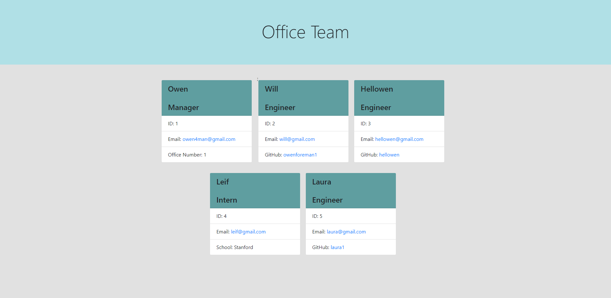

# Office-Team-Profile-Generator

## Description

I made an easy to use command line office team maker. I wanted to organize and have basic info for each employee on a generated html page. It displays an employees name, role, email and specific things for the role such as github username or school the intern came from. I use tests to make sure my code works for each employee and have scripts for each card to be displayed on page. I learned a lot about how tests work and how to build them. I learned a lot about how to use code from seperate files in a seperate file and a lot about OOP and TDD. 

## Table of Contents

- [Installation](#installation)
- [Usage](#usage)
- [Credits](#credits)
- [License](#license)

## Installation

The user should clone the repo and install node then install jest if they want to use the tests. Open the index.js in the command line and run it to start building your team. 

## Usage

Video Walkthrough => https://drive.google.com/file/d/1hxjE2rug6kt48-4BsJQHWU4iZufyAS0m/view

## License

MIT License

Copyright (c) [2022] [Owen Foreman]

Permission is hereby granted, free of charge, to any person obtaining a copy
of this software and associated documentation files (the "Software"), to deal
in the Software without restriction, including without limitation the rights
to use, copy, modify, merge, publish, distribute, sublicense, and/or sell
copies of the Software, and to permit persons to whom the Software is
furnished to do so, subject to the following conditions:

The above copyright notice and this permission notice shall be included in all
copies or substantial portions of the Software.

THE SOFTWARE IS PROVIDED "AS IS", WITHOUT WARRANTY OF ANY KIND, EXPRESS OR
IMPLIED, INCLUDING BUT NOT LIMITED TO THE WARRANTIES OF MERCHANTABILITY,
FITNESS FOR A PARTICULAR PURPOSE AND NONINFRINGEMENT. IN NO EVENT SHALL THE
AUTHORS OR COPYRIGHT HOLDERS BE LIABLE FOR ANY CLAIM, DAMAGES OR OTHER
LIABILITY, WHETHER IN AN ACTION OF CONTRACT, TORT OR OTHERWISE, ARISING FROM,
OUT OF OR IN CONNECTION WITH THE SOFTWARE OR THE USE OR OTHER DEALINGS IN THE
SOFTWARE.

## How to Contribute

Clone the repo and see what youd like to change.
owen4man@gmail.com

## Tests

Run the four tests with npm test. 